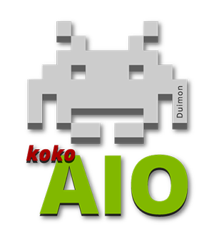
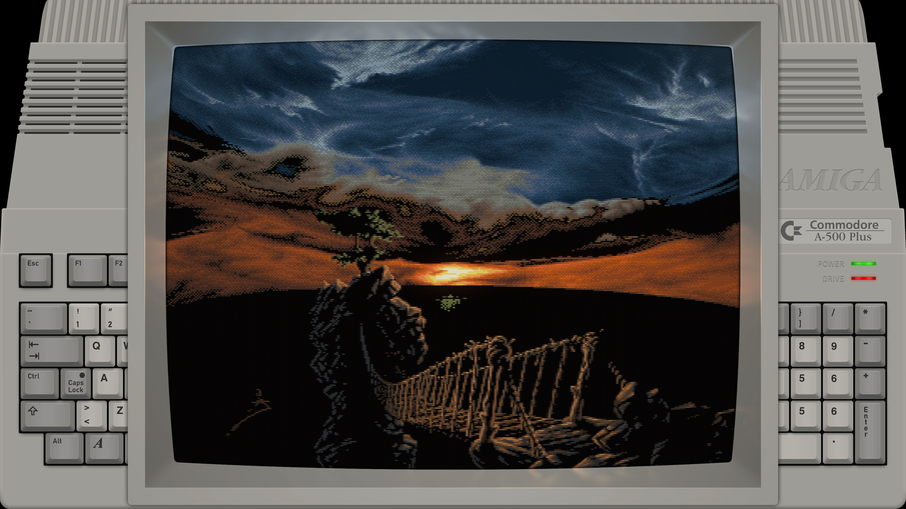
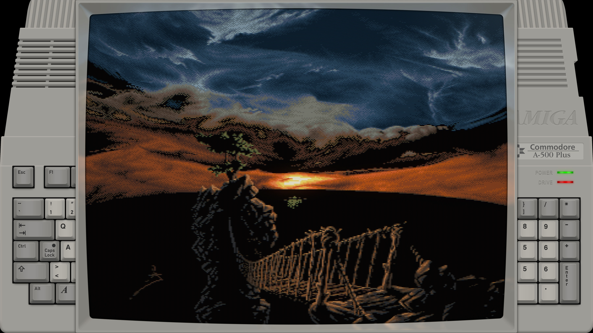
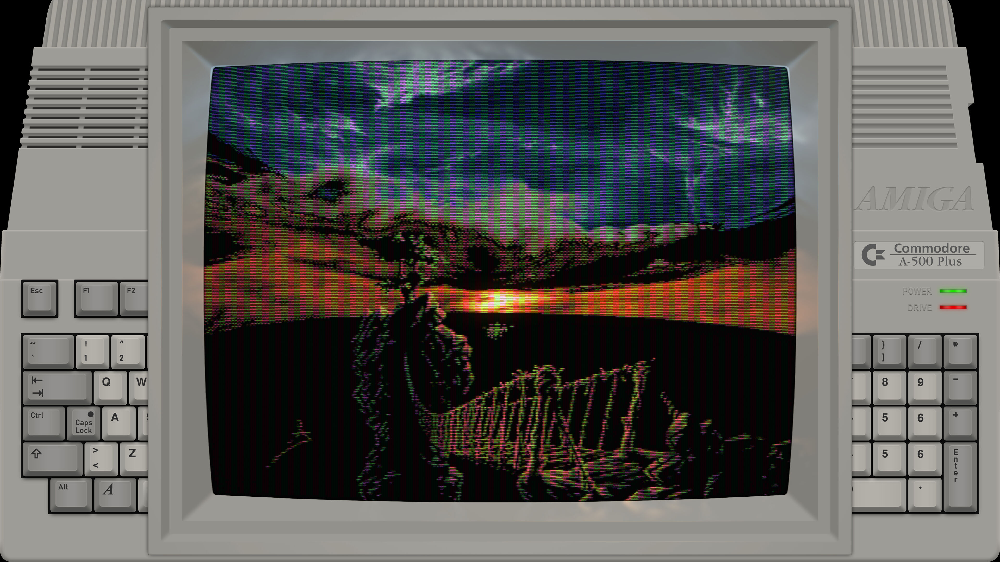
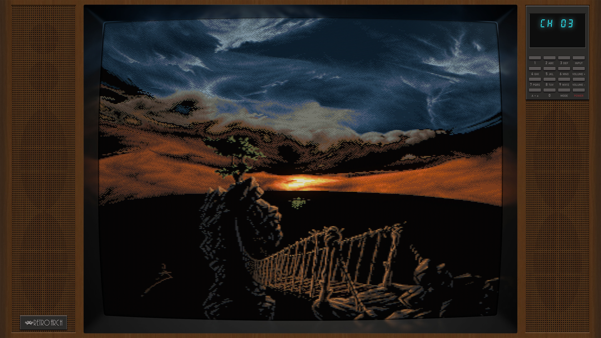

# Duimon koko-aio Presets

## Presets for the koko-aio shader project, derived from graphics created for use with the HSM Mega Bezel Reflection Shader.

This project is an attempt to provide end users with high quality art and ready to use OOTB presets for the wonderfully performant shader by kokoko3k.

My updates and feedback page is on Libretro:

https://forums.libretro.com/t/duimon-koko-aio-presets/45136

The shader discussion and updates page is at:

https://forums.libretro.com/t/koko-aio-shader-discussions-and-updates/38455/1430

The initial release includes 93 CRT systems, with handhelds forthcoming.

___

For those of you familiar with my Mega Bezel project, things will look very familiar. There are three different bezels included initially.

**[Bezel]**


**[Bezel_002]**


**[Bezel_003]**


And a few presets that use a frameless bezel.

**[TV7_Alt]**


___

## Installation

## Shader

The koko-aio shaders are bundled with RetroArch, although you may have to update your slang shaders if you are using an older version RetroArch.

## Installation using the release zip

The folder structure is...

    Retroarch/shaders/Duimon-koko-aio
        	/Graphics
        	/Presets  

An example presets folder and contents is...

    Retroarch/shaders/Duimon-koko-aio
    		/Presets
    			/Acorn_Archimedes
    				Acorn_Archimedes-[Bezel].slangp
    				Acorn_Archimedes-[Bezel]-Night.slangp
    				Acorn_Archimedes-[Bezel_002].slangp
    				Acorn_Archimedes-[Bezel_002]-Night.slangp
    				Acorn_Archimedes-[Bezel_003].slangp
    				Acorn_Archimedes-[Bezel_003]-Night.slangp  

Some Retroarch installations (Linux) have the "shader" folder outside of the root Retroarch folder. The preset paths are relative so the "shaders" folder can be anywhere (On any drive/mount.) as long as the correct shader path is defined in the Retroarch settings.

Unpack the release zip and move the newly extracted "Duimon-koko-aio" folder to "Retroarch/shaders/". (Or where your shaders folder is defined in the settings.)

To update, delete the “Duimon-koko-aio” folder and repeat the previous steps. (If files were renamed in an update it could leave unneeded files or broken presets.)

___

## Installation using git


You can install everything to a local clone and update using the following method.

1. Install Git. [https://git-scm.com/downloads](https://git-scm.com/downloads) using the default settings.
2. Enter the *"/Retroarch/shaders"* folder and from the command-line run:

```
git clone https://github.com/Duimon/Duimon-koko-aio
```

It will create a *"Duimon-koko-aio"* folder inside the *"shaders"* folder. 

To update, go into the *"Duimon-koko-aio"* folder (note the path difference) and run

```
git pull
```

Load your content and then a preset. I recommend creating a core preset next.

If you are using a multiple system core, and using it for multiple systems, I recommend creating a content directory preset.

___

This pack is using a custom minimal boilerplate that makes it easy to select from koko's 25 base presets, and apply local and global overrides for custom settings across each preset class.

I took pains to insure that the comments in the presets were self explanatory. If you need more guidance please read my "Boilerplate Introduction Guide" in my Mega Bezel repo.

https://github.com/Duimon/Duimon-Mega-Bezel/blob/main/guides/Boilerplate_Introduction.md

___

<a rel="license" href="http://creativecommons.org/licenses/by-nc-nd/4.0/"></a><br />This work is licensed under a <a rel="license" href="http://creativecommons.org/licenses/by-nc-nd/4.0/">Creative Commons Attribution-NonCommercial-NoDerivatives 4.0 International License</a>.
